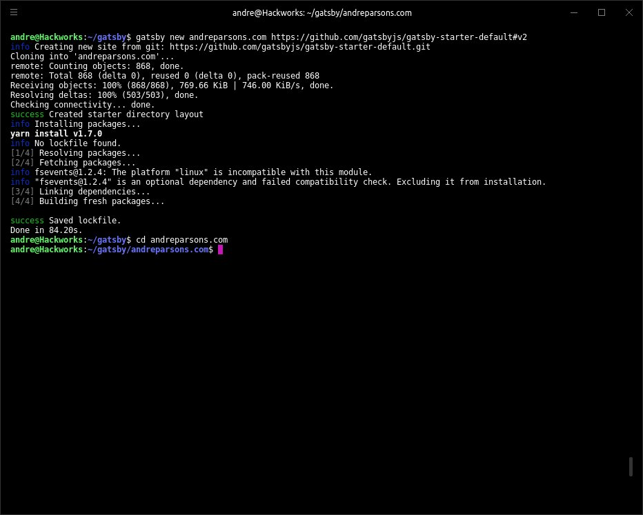
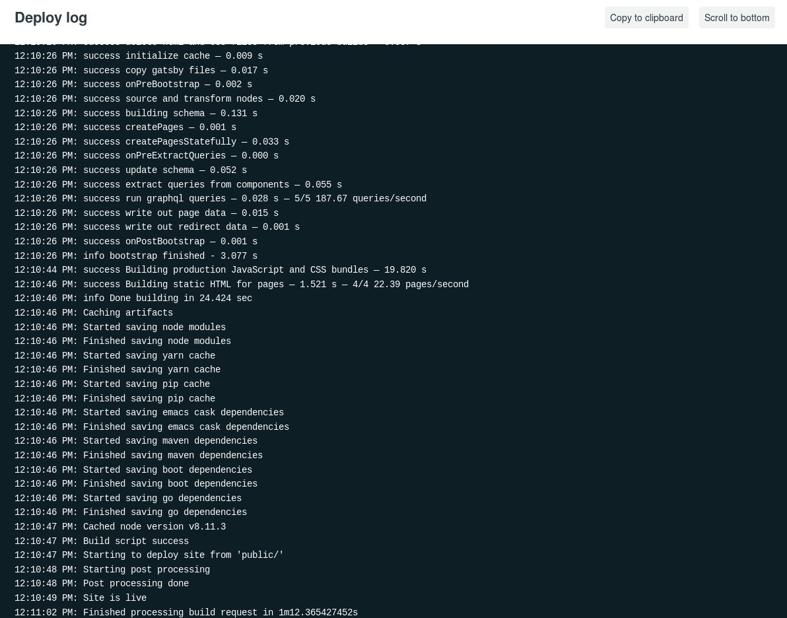

This website was made with [Gatsby.js](https://www.gatsbyjs.org), an absolutely fantastic framework for building static sites. A few weeks of playing around with it has more than convinced me to use it for my next project.

At the time of this post, the Gatsby v2 beta has been out for about a month. I will be using the beta build to construct this very site, documenting my progress as I go. I'm certain I'll ecounter breaking changes and I'll make my fair share of mistakes on the way, but I'm certain the effort will make me a better developer.

##Getting Up and Coding

The best part of Gatsby is not having to worry about setup. One command is all it takes to get up and running.

```
gatsby new andreparsons.com https://github.com/gatsbyjs/gatsby-starter-default#v2
```


##Hosting

I'll be using [Netlify](https://www.netlify.com) for hosting, because it's fast and free and can automate all off of the tedious back-end setup. Netlify is smart enough to build a site right from a GitHub repo, so all you need to do is point it at the right place and sit back and relax.



The default starter is online! Now every change that is pushed to GitHub will be picked up by netlify. I won't go into the details here, but Netlify has intutive setup process. I was able to hook up my custom domain and use [Let's Encrypt](https://letsencrypt.org) to enable HTTPS with a free SSL/TLS certificate.