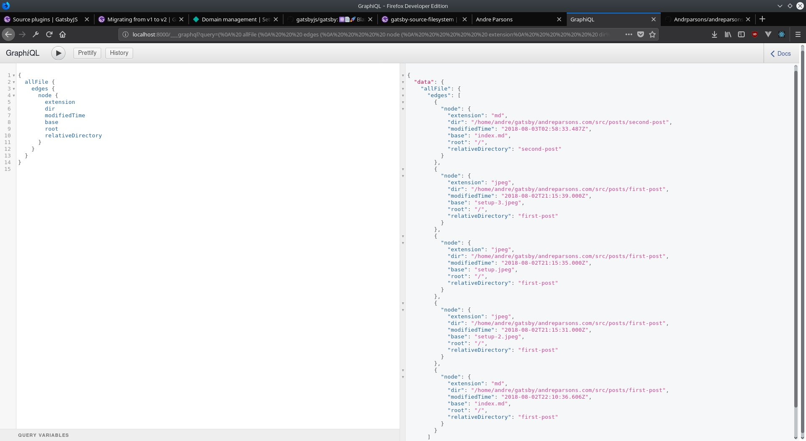

In order to avoid creating individual posts I'm going to leverage Graphql to pull in data from markdown files and then programatically create posts. Luckily there are seveal tools built in to help out.

##GraphiQL and Source Plugins

GraphiQL is the built in IDE that is used to construct queries on the site data. Since I need to pull in files a file system is needed as well.

##gatsby-source-filesystem

Installing the the gatsby-source-filesystem plugin and pointing at a directtory means that files can be referenced in graphql queries.

gatsby-config.js

```javascript
module.exports = {
  siteMetadata: {
    title: 'Andre Parsons',
    author: 'Andre Parsons',
    description: 'Personal blog and portfolio',
  },
  plugins: [
    {
      resolve: 'gatsby-source-filesystem',
      options: {
        path: `${__dirname}/src/posts`,
        name: 'posts',
      },
    },
    'gatsby-plugin-react-helmet',
  ],
}
```

##graphiql

Now it is possible to write queries to get information on files.



Except now we need to *do* something with this information, and luckily the transfomer-remark plugin can convert markdown to html.

Once installed we can query in the information *in* the files and turn it into html and insert into our components.


Now that files can be used, I need to actually put them into the blog
