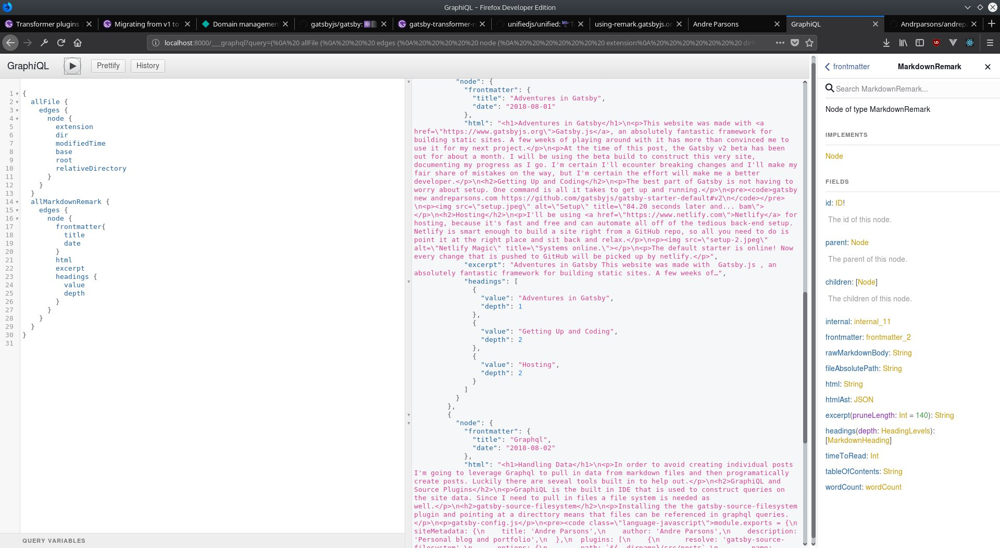

In order to avoid creating individual html pages for each post I'm going to leverage  the power of Graphql to pull in data from markdown files and then programatically generate the html. GraphQL is a query language created by Facebook to pull in data for react components. It functions as a universal API and it comes with a built in graphical IDE called GraphiQL (heh) to help test out and construct queries right in the browser.

In order to make use of markdown files, two Gatsby plugins are needed. The first is gatsby-source-filesystem which allows read access to files in a specified directory, allowing them to be queried with GraphQL. The second is gatsby-transformer-remark, which can take the markdown and convert it into usable html.

## Installing plugins and Configuration

```
npm install --save gatsby-source-filesystem@next gatsby-transformer-remark@next
```

At the time of this post, Gatsby V2 is still in beta so all plugins need to be tagged with '@next' to make sure that the V1 plugins are not pulled from NPM, as there are breaking changes.

Now that the plugins are installed they need to be added to the gatsby-config file. 

gatsby-config.js

```javascript
module.exports = {
  siteMetadata: {
    title: 'Andre Parsons',
    author: 'Andre Parsons',
    description: 'Personal blog and portfolio',
  },
  plugins: [
    {
      resolve: 'gatsby-source-filesystem',
      options: {
        path: `${__dirname}/src/posts`,
        name: 'posts',
      },
    },
    {
      resolve: 'gatsby-transformer-remark',
      options: {
        excerpt_separator: `<!-- end -->`,
      },
    },
    'gatsby-plugin-react-helmet',
  ],
}
```
GraphiQL is quite useful here because all of data is visible in a tree and queries can be constructed by selecting the nested elements. Each plugin comes with its own trees so it is possible to write new queries each time. For example gatsby-source-filesytem gives access to the allFile node and can be used like this:


Remark gives access to the allMarkdownRemark node, which has all of the information needed to programmatically generate pages like so:



The next installment will go over doing just that in real components.