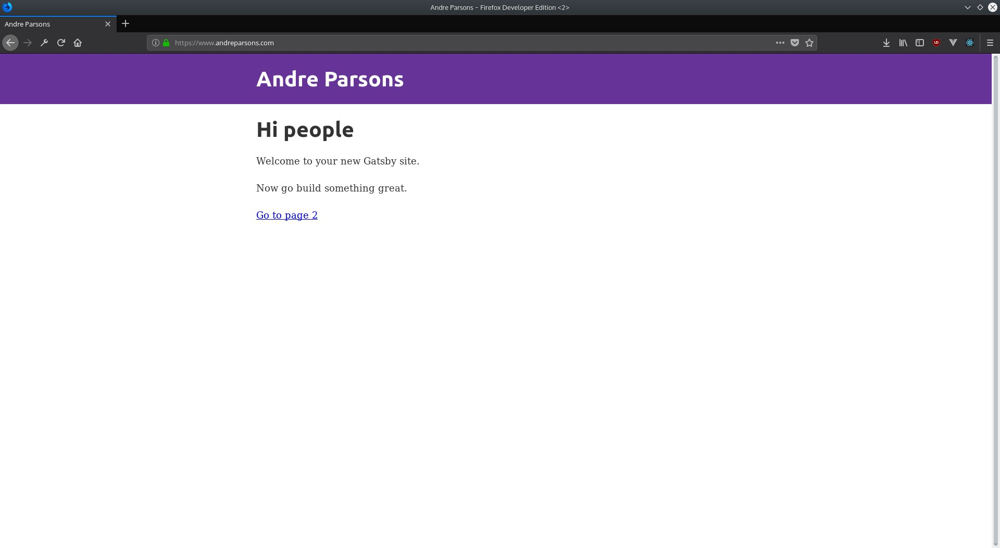

So far all I have done is setting up the back end, the front end is still just the standard default starter.



It's time to pull in the information from my files, but first we need a component to put it in.

###Making paths

```javascript
const path = require('path')
const { createFilePath } = require('gatsby-source-filesystem')

exports.onCreateNode = ({ node, getNode, actions }) => {
  const { createNodeField } = actions

  if (node.internal.type === 'MarkdownRemark') {
    const fileNode = getNode(node.parent)
    const slug = createFilePath({ node, getNode })
    createNodeField({
      node,
      name: 'slug',
      value: `/posts${slug}`,
    })
  }
}
```

###Making pages

```javascript
exports.createPages = ({ graphql, actions }) => {
  const { createPage } = actions
  return new Promise((resolve, reject) => {
    graphql(`
      {
        allMarkdownRemark {
          edges {
            node {
              fields {
                slug
              }
            }
          }
        }
      }
    `).then(result => {
      if (result.errors) {
        console.log(result.errors)
        reject(result.errors)
      }

      result.data.allMarkdownRemark.edges.forEach(({ node }) => {
        createPage({
          path: node.fields.slug,
          component: path.resolve('./src/components/blogPost.js'),
          context: {
            slug: node.fields.slug,
          },
        })
      })
      resolve()
    })
  })
}
```

###Listing posts

```javascript
import React from 'react'
import { Link } from 'gatsby'

const PostListing = ({ post }) => (
  <div>
    <h3>
      <Link to={post.fields.slug}>{post.frontmatter.title}</Link>
    </h3>
    <span>{post.frontmatter.date}</span>
  </div>
)

export default PostListing
```

###Posts

```javascript
import React, { Component } from 'react'
import { graphql } from 'gatsby'
import Layout from '../components/layout'

export default class blogPost extends Component {
  render() {
    const { data } = this.props
    return (
      <Layout>
        <span>{data.markdownRemark.frontmatter.date}</span>
        <h1>{data.markdownRemark.frontmatter.title}</h1>
        <div
          dangerouslySetInnerHTML={{
            __html: data.markdownRemark.html,
          }}
        />
      </Layout>
    )
  }
}

export const query = graphql`
  query BlogPostQuery($slug: String!) {
    markdownRemark(fields: { slug: { eq: $slug } }) {
      html
      frontmatter {
        title
        date(formatString: "MMMM DD YYYYY")
      }
    }
  }
`
```

The pictures don't work though - some more configuration is needed for that