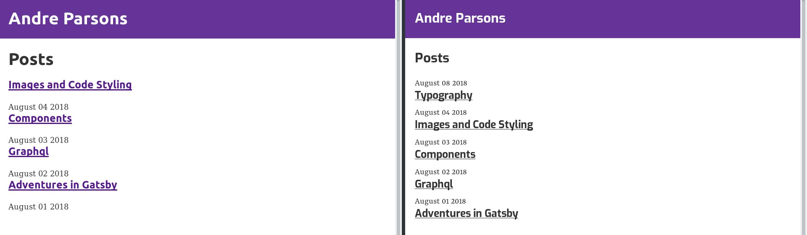

In order to manage the site's global style, I'm going to be using the [Typography.js](https://github.com/kyleamathews/typography.js) library.

I can use themes and set the properties of elements without having to individually change multiple CSS rules.

In order to use it the following NPM packages are needed:

1. typography
2. react-typography
3. gatsby-plugin-typography

I also will be using  the base [themes](https://github.com/KyleAMathews/typography.js#published-typographyjs-themes). It can be applied sitewide by creating a typography config file like so:

```javascript
import Typography from "typography"
import irvingTheme from 'typography-theme-irving'

const typography = new Typography(irvingTheme)

export default typography
```

And call it in the config file:

```javascript
{
  resolve: 'gatsby-plugin-typography',
  options: {
    pathToConfigModule: 'src/utils/typography',
  },
},
```

