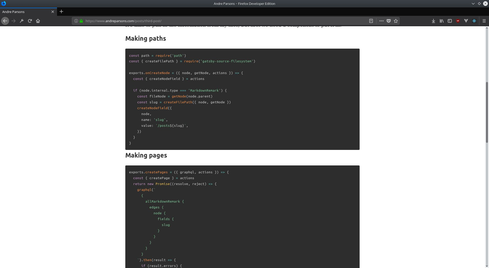

Needed plugins for images:

* gatsby-remark-images
* gatsby-plugin-sharp
* gatsby-transformer-sharp

Needed plugins for Code Styling:

* gatsby-remark-prismjs
* prismjs

```javascript
resolve: 'gatsby-transformer-remark',
options: {
  excerpt_separator: `<!-- end -->`,
  plugins: [
    {
      resolve: 'gatsby-remark-images',
      options: {
        maxWidth: 960,
        showCaptions: true,
        sizeByPixelDensity: true,
        withWebp: true,
      },
    },
    'gatsby-remark-prismjs',
  ],
}
```

Don't forget to link to the css theme and we can get some instantly well styled code.



import 'prismjs/themes/prism-tomorrow.css'